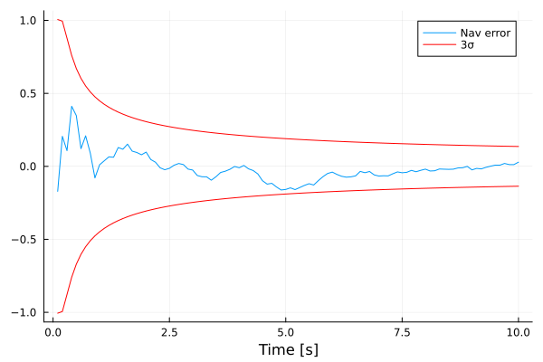

```@meta
CurrentModule = KalmanFilterEngine
```

# KalmanFilterEngine.jl
This package provides a set of Kalman filters that can estimate the state of a continuous-time dynamical system
given as imput a sequence of discrete-time measurements
```math
\begin{array}{c}
\dot x = f(t,x) + w\\
y_k = h(t_k,x_k) + r_k
\end{array}
```
where ``w`` is a zero-mean continuous time white process noise with two-sided power spectral density equal to ``W``, 
and ``r_k`` is a zero-mean discrete time white measurement noise with covariance equal to ``R_k``. 


# Installation
Just type:
```julia
using Pkg
Pkg.add(url="https://github.com/FraCpl/KalmanFilterEngine.jl")
```

# Capabilities and basic usage
Four different filters are implemented in ```KalmanFilterEngine.jl```
* Extended Kalman Filter (EKF)
* UD-factorized Extended Kalman Filter (UDEKF)
* Unscented Kalman Filter (UKF)
* Square-root Unscented Kalman Filter (SRUKF)
The type of filter can be chosen when initializing the navigation state via the four different
initialization functions available: [`NavState`](@ref) (EKF), [`NavStateUD`](@ref) (UDEKF), [`NavStateUKF`](@ref) (UKF), and 
[`NavStateSRUKF`](@ref) (SRUKF). 
```KalmanFilterEngine.jl``` provides the two necessary key functions that need to be used to build a Kalman filter: [`kalmanPropagate!`](@ref)
and [`kalmanUpdate!`](@ref). Whichever the filter chosen by the user, these two functions will have the same exact interface,
to make it easy to swap and test different filters formulations with minimal to no modification to the Kalman filter design.

For example, the following simple single-step Kalman filter
```julia
function myKalmanStep!(nav, ty, y)
    kalmanUpdate!(nav, ty, y, h)
    kalmanPropagate!(nav, Δt, f, Q)
end
```
can be reused whichever the filter formulation
```julia
ty, y = myMeasFun(...)              # Get measurement

navEKF = NavState(t₀, x₀, P₀)       # Initialize EKF state
myKalmanStep!(navEKF, ty, y)        # execute EKF step

navUKF = NavStateUKF(t₀, x₀, P₀)    # Initialize UKF state
myKalmanStep!(navUKF, ty, y)        # Execute UKF step
```

The key parameters that are needed to define the navigation problem, and that need to be feed to the Kalman filter
functions are the **system dynamics function**, which returns the navigation state vector time derivative:
```julia
function f(t, x)
    ...
    return ẋ
end
```
and the **measurement function**, which returns the predicted measurement ```y```, the measurement noise 
covariance ```R```, and the measurement jacobian with respect to the navigation state ```H``` (only needed for EKF and UDEKF):
```julia
function h(t, x)
    ...
    return y, R, H
end
```
An alternative and convenient way to compute ```H``` is to use automatic differentiation capabilities provided by,
e.g., [`ForwardDiff.jl`](https://juliadiff.org/ForwardDiff.jl/stable/). In this case the user can split the measurement function as follows
```julia
using ForwardDiff

function myMeas(t, x)
    ...
    return y
end

H(t, x) = ForwardDiff.jacobian(x -> myMeas(t, x), x)

function h(t, x)
    ...
    return myMeas(t, x), R, H(t, x)
end
```

The user shall also supply the discrete-time process noise covariance matrix ```Q```. This can be easily computed
using the [`computeQd`](@ref) function.

When using EKF or UDEKF, the user has also the option to provide as input the Jacobian of the dynamics ```Jf(t,x)```
to the [`kalmanPropagate!`](@ref) function. If not provided, the function automatically computes the Jacobian using
[`ForwardDiff.jl`](https://juliadiff.org/ForwardDiff.jl/stable/).

!!! note
    One may argue that there is no need to use an UDEKF or a SRUKF when working with ```Float64```.
    Indeed, *"most smokers do not get cancer or heart disease"*.

## Working example
The following code proposes a simple working example to get started with ```KalmanFilterEngine.jl```. 
It is based on a double integrator dynamics where 3D position measurements are provided to an Extended
Kalman Filter. 

```julia
using KalmanFilterEngine, LinearAlgebra, Distributions, Plots

# True state parameters & state transition matrix
x₀ = zeros(6)                                   # True initial state
Δt = 0.1                                        # Measurement time step
Φ = I + [zeros(3,3) Δt*I; zeros(3,6)]           # State transition matrix

# Define navigation problem
Q = Diagonal([1e-4*ones(3); 1e-3*ones(3)].^2)   # Process noise covariance
R = 0.0483*Matrix(I,3,3)                        # Measurement noise covariance
f(t, x) = [x[4:6]; zeros(3)]                    # System dynamics
h(t, x) = (x[1:3], R, [I zeros(3,3)])           # Measurement equation

# Initialize navigation state
P₀ = generatePosDefMatrix(6)            # Initial state uncertainty covariance
x̂₀ = x₀ + rand(MvNormal(P₀))            # Initial estimated state
nav = NavState(0.0, x̂₀, P₀)

# Define Kalman filter algorithm
function myKalman!(nav, y)
    kalmanUpdate!(nav, 0.0, y, h)
    kalmanPropagate!(nav, Δt, f, Q)
end

# Simulate Kalman filter
T = []; X = []; X̂ = []; σ = []
x = x₀
for k in 1:100
    # Generate measurement
    y = x[1:3] + rand(MvNormal(R))

    # Execute Kalman filter step
    myKalman!(nav, y)

    # Simulate system dynamics
    x = Φ*x + rand(MvNormal(Q))

    # Save for post-processing
    push!(T, nav.t)
    push!(X, x)
    push!(X̂, nav.x̂)
    push!(σ, getStd(nav))
end

# Plot results for 1st coordinate
plot(T, getindex.(X,1) - getindex.(X̂,1), lab="Nav error", xlabel="Time [s]")
plot!(T, +3.0*getindex.(σ,1); color=:red, lab="3σ")
plot!(T, -3.0*getindex.(σ,1); color=:red, lab="")
```
The example should produce the following kind of plot: 



Notice how the [`NavState`](@ref) structure provides a direct access to the estimated state ```nav.x̂``` and
the corresponding time ```nav.t```, while the [`getStd(nav)`](@ref) function returns the square-root of the 
diagonal of the covariance matrix of the filter (the full covariance matrix can be retrieved with the 
[`getCov(nav)`](@ref) function).

A more advanced example for a nonlinear orbit estimation problem can be found in the 'examples' folder.


## Consider states
All filters support consider states, with the assumption that the navigation state defined by the user is already
partitioned into solve-for states ``\hat x_s`` and consider states ``\hat x_c``, and that the consider states are 
in the tail of the navigation state, i.e., ``\hat x = [\hat x_s; \hat x_c]``. By default, all states are considered
to be solve-for states. The number of solve-for states can be modified using the ```.ns``` field of the navigation 
state:
```julia
nav = NavState(t₀, x₀, P₀) 
nav.ns = 6
```

## Error state formulation
EKF and UDEKF also provide an error state formulation, where the [`kalmanUpdate!`](@ref) routine can be replaced by 
[`kalmanUpdateError!`](@ref). This is particularly useful when multiple measurements need to be ingested by the filter
during the same update cycle to make the filter insensitive to the order by which measurements are processed. 
In this case, the Kalman update procedure needs to be followed by a full state update
(generally consisting in adding the error state to the full navigation state) and an error state reset:
```julia
# Kalman filter update step
kalmanUpdateError!(nav, ty1, y1, h1)
kalmanUpdateError!(nav, ty2, y2, h2)
kalmanUpdateError!(nav, ty3, y3, h3)
...

# Update full state and reset error state
nav.x̂ += nav.δx
resetErrorState!(nav)

# Kalman filter propagation
...
```

# API
```@autodocs
Modules = [KalmanFilterEngine]
Order   = [:function, :type]
Pages   = ["ekf.jl", "udekf.jl", "ukf.jl", "srukf.jl", "utils.jl"]
```

## Index
```@index
```

# About the author
```KalmanFilterEngine.jl``` was developed by [Francesco Capolupo](https://www.linkedin.com/in/francescocapolupo/),
GNC System Engineer at the [European Space Agency](https://esa.int), who has more than 10 yearse experience in the 
design, analysis, and development of spacecraft GNC subsystems in industry and at the Agency. 

**DISCLAIMER:** this package has no ties whatsoever with ESA, or any other institution, corporation,
 or company, and it only represents a desperate and personal attempt to quit using MATLAB once and for all.